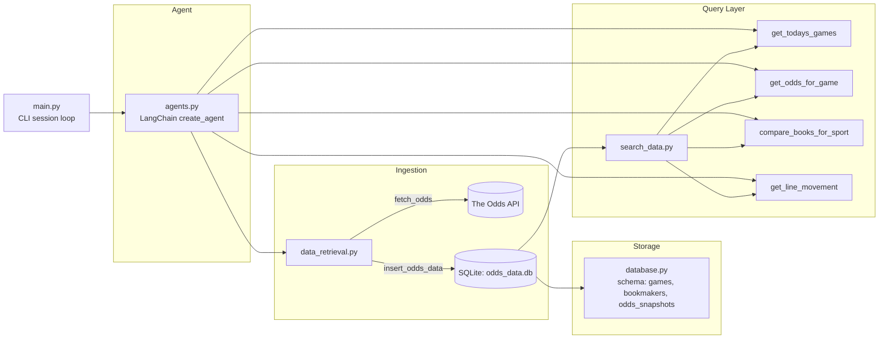

# odds_agent

A Python CLI sports betting odds agent powered by LangChain and The Odds API. Ask questions in natural language and get real-time odds comparisons, line movements, and game data stored locally in SQLite.


## Architecture


```mermaid
flowchart LR
    subgraph Ingestion
        A[data_retrieval.py] -->|fetch_odds| B[(The Odds API)]
        A -->|insert_odds_data| C[(SQLite: odds_data.db)]
    end

    subgraph Storage
        C --> D[database.py<br/>schema: games, bookmakers, odds_snapshots]
    end

    subgraph Query Layer
        C --> E[search_data.py]
        E --> E1[get_todays_games]
        E --> E2[get_odds_for_game]
        E --> E3[compare_books_for_sport]
        E --> E4[get_line_movement]
    end

    subgraph Agent
        F[agents.py<br/>LangChain create_agent] --> A
        F --> E1
        F --> E2
        F --> E3
        F --> E4
    end

    G[main.py<br/>CLI session loop] --> F
```

## File Status

| File | Status | Notes |
|---|---|---|
| `database.py` | ✅ Complete | Schema for `games`, `bookmakers`, `odds_snapshots` |
| `data_retrieval.py` | ✅ Complete | `fetch_odds` + `insert_odds_data` |
| `search_data.py` | ✅ Complete | All four query functions written, typed, and documented |
| `agents.py` | ✅ Complete | `create_agent` (model `claude-sonnet-5`) with all five tools registered |
| `main.py` | ✅ Complete | Interactive CLI loop (`while session is True`) |

## Database Schema

```
games:            id, odds_api_event_id, sport, league, home_team, away_team,
                   commence_time, home_score, away_score, status

bookmakers:       id, odds_api_key, name, region

odds_snapshots:   id, game_id, bookmaker_id, market_type, home_price,
                   away_price, spread_line, fetched_at
```

`odds_snapshots.game_id` and `odds_snapshots.bookmaker_id` are foreign keys referencing `games.id` and `bookmakers.id`, respectively.

## Agent Tools

- `fetch_odds(sport)` — hits The Odds API for current/upcoming odds, upserts games and bookmakers, inserts odds snapshots into SQLite
- `get_todays_games(sport)` — today's games for a sport
- `get_odds_for_game(game_id)` — all bookmaker odds for one game
- `compare_books_for_sport(sport)` — odds across bookmakers, grouped by game, with `market_type` (`h2h` or `spreads`) on each row
- `get_line_movement(game_id, market_type)` — odds over time for one game/market, grouped by bookmaker

## Setup

1. Clone the repo and create a virtual environment:
   ```bash
   python -m venv venv
   source venv/bin/activate
   ```
2. Install dependencies:
   ```bash
   pip install -r requirements.txt
   ```
3. Create a `.env` file in the project root:
   ```
   ANTHROPIC_API_KEY=your_anthropic_api_key_here
   THE_ODDS_API_KEY=your_odds_api_key_here
   ```
4. Run `python3 main.py` to start the CLI agent loop. `create_table()` runs once automatically to initialize the database.

## API Keys

- The Odds API: [the-odds-api.com](https://the-odds-api.com)
- Anthropic API: [console.anthropic.com](https://console.anthropic.com)

## Roadmap

**v1 (current):** CLI agent that fetches odds from The Odds API, stores them in SQLite, and answers natural language queries through LangChain-registered tools. `home_score`/`away_score` (games) and `spread_line` (odds_snapshots) are now correctly nullable, repeated fetches upsert instead of crashing or duplicating bookmakers, and a first clean end-to-end run (fetch → insert → query → natural language answer) is confirmed against real WNBA odds data. `compare_books_for_sport` has been verified against real data. Remaining before v1 is truly done: verify `get_line_movement` against real (not just empty-table) data, and capture a real terminal transcript for the README/portfolio.

**v2 (planned):** Odds calibration analysis. Convert stored prices (e.g. -150) into implied win probabilities, then compare against actual outcomes (`home_score` vs `away_score` in the `games` table) to measure how accurate the odds have historically been. Blocker: those columns are `NULL` for every game right now — `fetch_odds` only hits the Odds API's `/odds` endpoint. Needs a new fetch function against the separate `/v4/sports/{sport}/scores` endpoint to actually populate results.

**v3 (planned):** Line movement prediction. Builds on v2's output rather than standing alone — line movement is only meaningful in light of how reliable the odds are as a signal in the first place. Calibration analysis has to come first to establish that baseline; without it, a "prediction" about line movement would be indistinguishable from noise.

**Future:** Kalshi integration — automated trading bot (order execution, portfolio/risk management via `OrderManager`/`Portfolio` classes). A meaningfully higher-stakes tier of the project, to be tackled once the odds/reasoning layer is solid.
